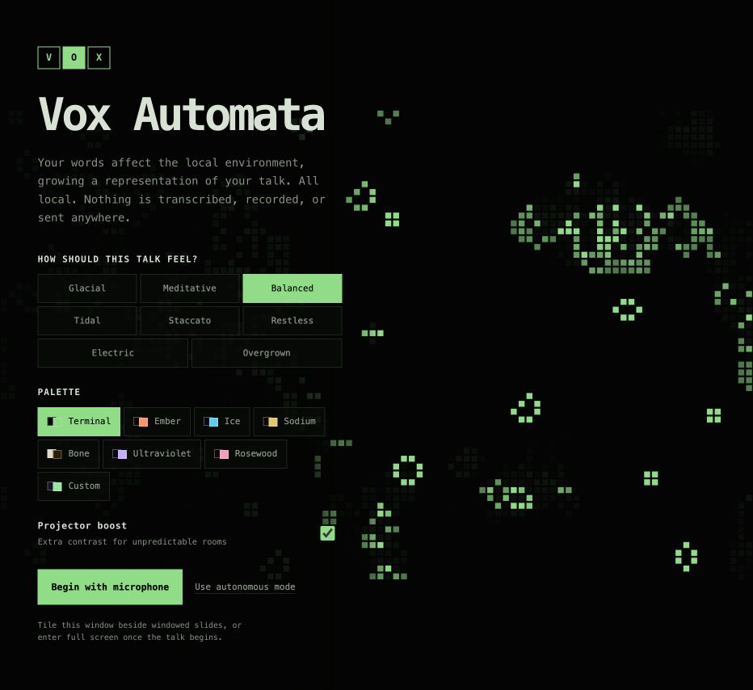
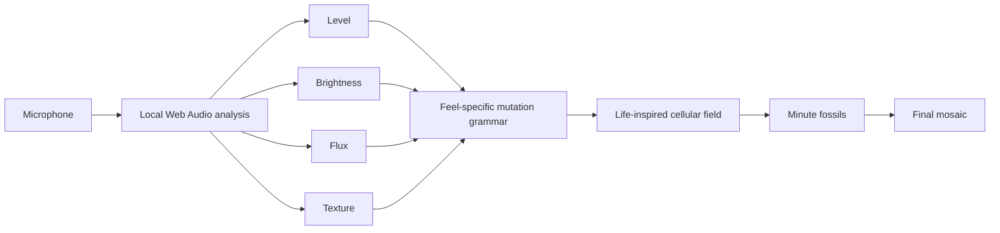
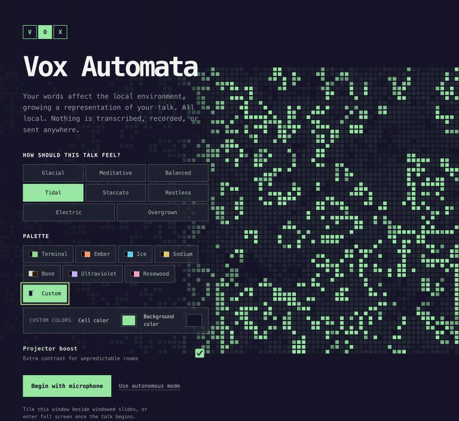
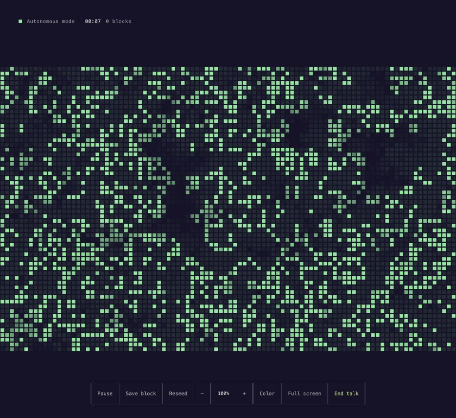
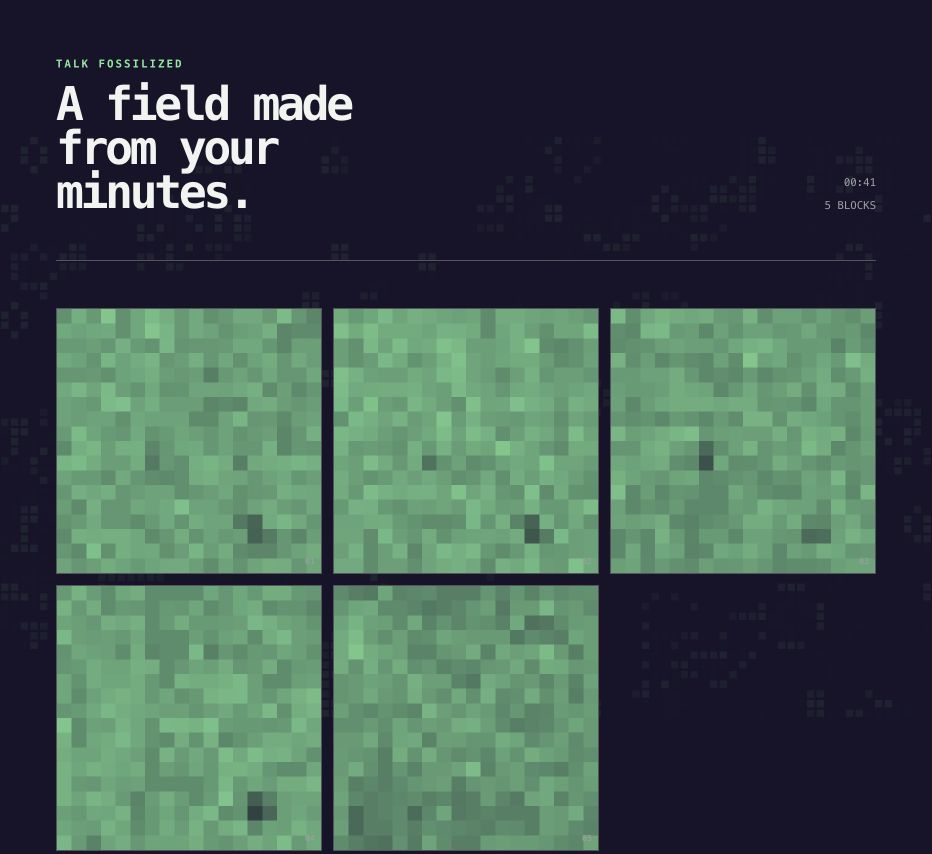

# Vox Automata

[Open the live visualizer](https://game-of-talk.jessh.chatgpt.site/)

Vox Automata is a private, speech-responsive cellular visualizer for live
presentations. It listens to the changing energy, brightness, texture, and
cadence of a speaker's voice, then turns those qualities into environmental
forces inside a Life-inspired field.

It does **not** transcribe speech, interpret meaning, record audio, upload audio,
or send microphone-derived data anywhere. Voice becomes cellular behavior, not
content.



## Contents

- [Why it exists](#why-it-exists)
- [Use it for a talk](#use-it-for-a-talk)
- [How speech affects the field](#how-speech-affects-the-field)
- [Talk feels](#talk-feels)
- [Palettes and custom colors](#palettes-and-custom-colors)
- [Live controls](#live-controls)
- [Minute blocks and the final mosaic](#minute-blocks-and-the-final-mosaic)
- [Privacy](#privacy)
- [Browser and projector guidance](#browser-and-projector-guidance)
- [Local development](#local-development)
- [Architecture](#architecture)
- [Testing](#testing)

## Why it exists

Slides tend to remain fixed while a talk changes in the room. Vox Automata gives
that changing energy a visual presence without illustrating the speaker's words
literally or competing with the talk.

The visualizer is designed to:

- sit beside windowed slides as an ambient companion;
- fill a projector when the cellular field is the presentation;
- remain visually interesting during silence;
- respond to vocal dynamics without reacting to every syllable;
- work for 20 to 30 minute talks on an ordinary laptop;
- leave behind a downloadable artifact shaped by the talk.

## Use it for a talk

### Fast start

1. Open [Vox Automata](https://game-of-talk.jessh.chatgpt.site/) in Chrome,
   Edge, or Arc.
2. Select a **feel**. The setup field previews its cellular behavior
   immediately.
3. Select a paired palette or choose custom cell and background colors.
4. Keep **Projector boost** enabled for washed-out or unpredictable displays.
5. Select **Begin with microphone** and allow microphone access.
6. Tile the window beside windowed slides, or select **Full screen**.
7. Select **End talk** when finished to assemble the chronological mosaic.

No account, API key, server, or configuration file is required.

### Rehearsal and fallback mode

Select **Use autonomous mode** to run the same field with a synthetic,
speech-like climate. This is useful for:

- rehearsing without granting microphone access;
- testing projectors and room layouts;
- demonstrating the visualizer in a quiet room;
- continuing when the microphone API is unavailable.

## How speech affects the field

Vox Automata uses the browser's Web Audio APIs to calculate four lightweight
features locally:

| Feature | What it measures | Cellular influence |
| --- | --- | --- |
| Level | Overall microphone energy | Mutation strength and amount of new matter |
| Brightness | Spectral center of the voice | Direction, orientation, and spatial drift |
| Flux | Sudden change between audio frames | Accents, phrase onsets, branching, and hot cells |
| Texture | Balance between lower and higher bands | Compact versus dispersed structures |

These values act as environmental pressure. They never become captions,
waveforms, word clouds, or semantic illustrations.



The simulation remains resolution-independent. Browser size changes how the
field is rendered, not the underlying grid state.

## Talk feels

The eight feels use different spatial grammars and neighbor rules. They are not
simple speed presets.

| Feel | Spatial behavior | Character |
| --- | --- | --- |
| **Glacial** | Mirrored crystalline slabs | Slow, durable structures that rotate and erode gradually |
| **Meditative** | Breathing double orbits | Sparse, symmetrical motion with long visual memory |
| **Balanced** | Drifting spore clouds | A neutral mix of movement, density, and classic Life behavior |
| **Tidal** | Field-wide sine bands | Broad wavefronts that swell and travel through the field |
| **Staccato** | Isolated rotated motifs | Accents and phrase onsets create sharp marks that clear quickly |
| **Restless** | Uneven satellite colonies | Local clusters migrate around a nervous wandering source |
| **Electric** | Connected branching bolts | Fast forks and expansive births produce energetic fractures |
| **Overgrown** | Frontier-driven branching | New growth extends from the exposed edges of older colonies |

The setup screen runs a synthetic preview of the selected grammar. You can
click through the feels and see their differences before starting microphone
analysis.


The underlying rules remain loosely based on Conway's Game of Life. Individual
feels alter survival and birth probabilities so their spatial gestures have
different consequences over time.

## Palettes and custom colors

Every preset is a paired theme. It changes the living cells, trails, field
background, controls, text, and signal colors together.

| Palette | Intended character |
| --- | --- |
| **Terminal** | Default warm-green phosphor on tinted near-black |
| **Ember** | Orange-red life on a warm dark ground |
| **Ice** | Cyan cells on a cool blue-black field |
| **Sodium** | Amber-yellow cells with warm projected contrast |
| **Bone** | Dark cells on a light field for weak projectors |
| **Ultraviolet** | Violet life with restrained warm signals |
| **Rosewood** | Rose cells on a deep red-violet ground |
| **Custom** | Independent cell and background color pickers |

Custom mode derives readable panel, trail, signal, and text colors from the two
selected colors. The custom palette also carries into saved blocks and the
downloaded mosaic.



### Projector boost

Projector boost raises cell contrast to help the field survive bright rooms,
old projectors, and aggressive display calibration. Leave it enabled by
default, then disable it only when the screen already has excellent contrast.

## Live controls

The live field keeps its interface at the edges so the visualization remains
the dominant surface.



| Control | Purpose | Shortcut |
| --- | --- | --- |
| Pause / Resume | Stop or resume speech response while the field continues evolving | `P` |
| Save block | Capture an additional fossil immediately | `B` |
| Reseed | Replace the current population without restarting the talk | `R` |
| Intensity | Adjust how strongly speech affects mutations | `-` / `+` |
| Color | Cycle through preset and custom palettes | `C` |
| Hide controls | Remove or restore the live interface | `H` |
| Full screen | Enter or leave browser full-screen mode | `F` |
| End talk | Finish the session and assemble its mosaic | `E` |

In full-screen mode, controls fade when idle and return with pointer movement.
The timer pauses only when the presenter explicitly pauses the response.

## Minute blocks and the final mosaic

Every 60 seconds, Vox Automata downsamples the living field and its fading cell
memory into a small fossil block. **Save block** can capture additional moments
between automatic boundaries.

When the talk ends:

1. a partial final minute is captured when needed;
2. blocks remain in chronological order;
3. the blocks are arranged into a responsive mosaic;
4. **Download mosaic** exports the composition as a PNG.

Only visual cell state is preserved. No audio is included in a block or export.



## Privacy

Microphone processing happens entirely in the browser:

- `getUserMedia` requests the selected microphone stream;
- `AudioContext` and `AnalyserNode` calculate short-lived audio features;
- only the current smoothed feature values affect the simulation;
- raw audio is never recorded or stored;
- no transcript is created;
- no microphone-derived value is sent to a server;
- closing or finishing the talk stops the media tracks and audio context.

The hosted application still downloads its normal static web assets when it
loads. Microphone input and its derived features remain on the device.

## Browser and projector guidance

### Supported environment

- Current Chrome, Edge, or Arc
- Laptop with Web Audio and microphone permissions
- HTTPS when using the hosted version
- Node.js 22.13 or newer for local development

### Slide layouts

For a one-screen talk, use the slide application's windowed presentation mode
and tile Vox Automata beside it. A true full-screen slide show will generally
cover every other window.

For a two-screen or projector setup, move the browser window to the presentation
display and use **Full screen**.

### Performance

- The simulation uses a fixed `96 × 60` cellular grid.
- Rendering scales to the available canvas without changing simulation state.
- Device pixel ratio is capped at `2`.
- Feel mutations have bounded point counts.
- The minute archive stores compact downsampled blocks rather than full frames.

## Local development

### Prerequisites

- Node.js `22.13` or newer
- npm

### Install and run

```bash
git clone https://github.com/jessholbrook/game-of-talk.git
cd game-of-talk
npm install
npm run dev
```

Open the local URL printed by the development server.

### Production build

```bash
npm run build
npm start
```

### Quality checks

```bash
npm test
npm run lint
npx tsc --noEmit
```

No environment variables are required.

## Architecture

| Path | Responsibility |
| --- | --- |
| `app/talk-visualizer.tsx` | Web Audio analysis, presenter state, canvas rendering, feel and palette configuration |
| `lib/life.mjs` | Deterministic Life rules, seeded RNG, spatial mutations, fossil downsampling, mosaic layout |
| `app/globals.css` | Responsive setup, live controls, palettes, projector-safe visual styling |
| `tests/life.test.mjs` | Deterministic cellular, pattern, probability, fossil, and layout tests |
| `tests/rendered-html.test.mjs` | Production-rendered setup, privacy, feel, and palette coverage |
| `PRODUCT.md` | Product purpose, audience, privacy principles, and anti-references |
| `DESIGN.md` | Color, typography, layout, motion, palette, and feel system |
| `docs/CELL_BEHAVIOR_PHILOSOPHY.md` | Generative philosophy behind the eight spatial grammars |

The simulation helpers are pure and accept an injected seeded random-number
generator. This keeps cellular behavior reproducible and testable while the
browser layer remains responsible for time, audio, and rendering.

## Testing

The test suite currently covers:

- classic Life still-life and oscillator behavior;
- safe handling of empty and tiny grids;
- deterministic seeded creation and mutations;
- eight distinct, reproducible spatial feel patterns;
- expanded neighbor-rule behavior;
- probability clamping and valid cell values;
- immutable fossil snapshots;
- mosaic layouts for empty, narrow, and talk-length archives;
- production server rendering;
- presence of all feels, palettes, fallbacks, and privacy language.

Run the full production build and all eleven tests with:

```bash
npm test
```

## Further reading

- [Product brief](PRODUCT.md)
- [Design system](DESIGN.md)
- [Cell behavior philosophy](docs/CELL_BEHAVIOR_PHILOSOPHY.md)
